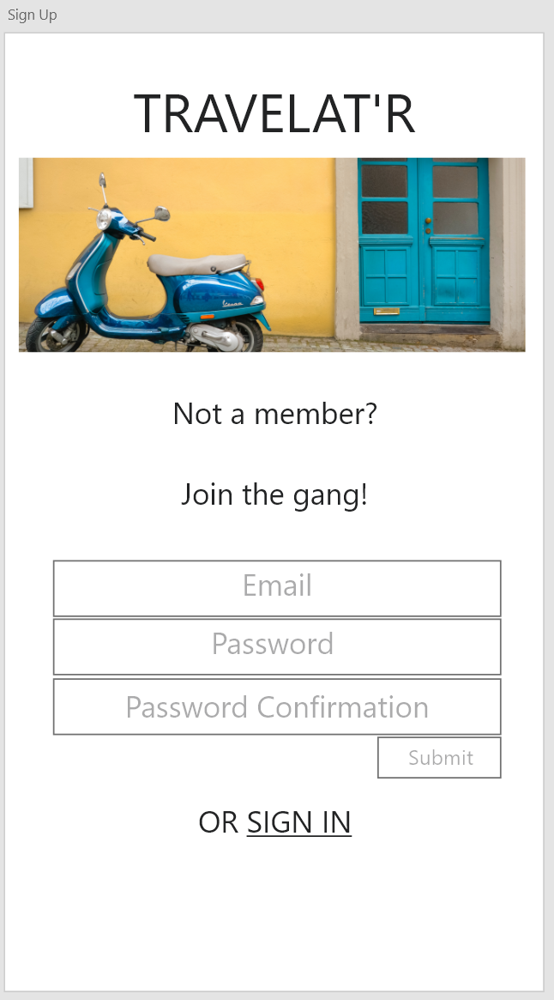
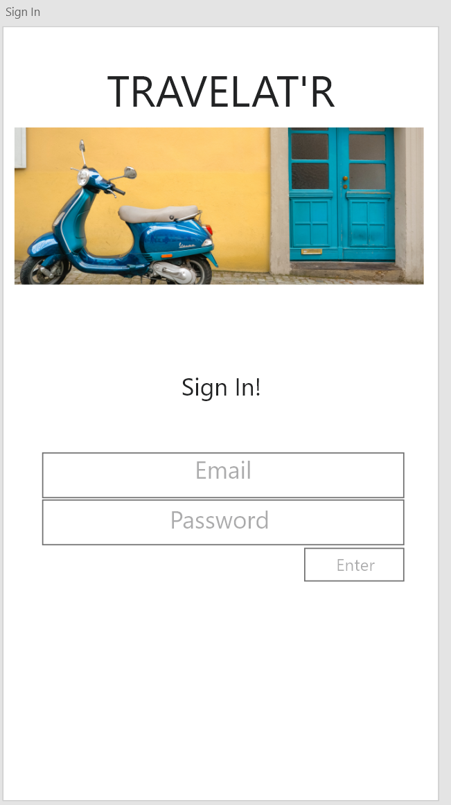
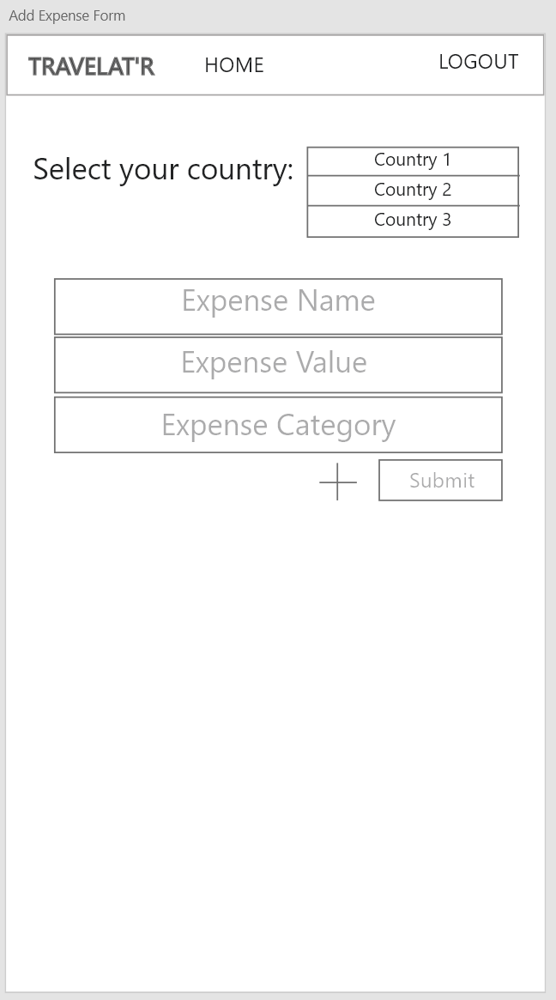

## TRAVELATR APPLICATION

- When running the application locally: 
    1. Start the [backend](https://github.com/carnold18/travelatr-rails-api) server first at __http://localhost:3000/__
    2. Run `npm start` in the termninal for the React application second
- If you run into port issues, check the __API_URL__ constant in `src/constants.js` - this may need to be updated to a different port

***

### PRELIMINARY [WIREFRAMES](https://xd.adobe.com/view/4e0ccd44-5df5-4431-48cb-aac660e6f9f1-383d/) - 12/30/2019

#### Sign Up View 

#### Sign In View

#### Home Page

#### Country-Specific Expense View

#### New Expense View 

### Resources for UI: 
 - Adobe XD Wireframes
 - [Material Design - Android](https://material.io/resources/)
 - [Unsplash](https://unsplash.com/)
 - [Hemingway Editor](http://www.hemingwayapp.com/)

